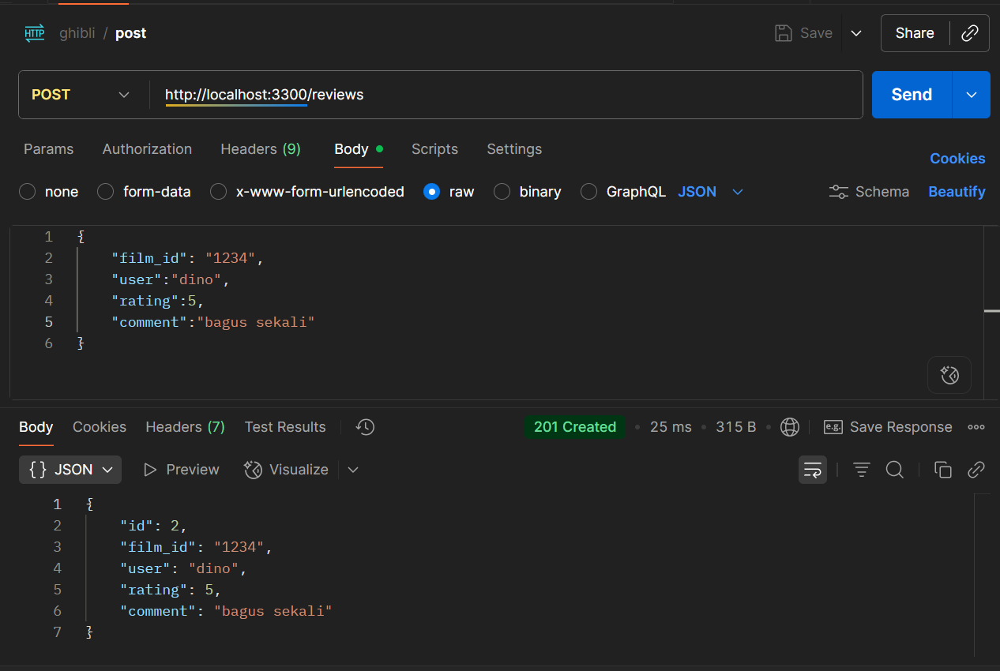

# Proyek API Ulasan Film - Kelompok 7

## Anggota kelompok
- Dino Febiyan
- Cheryl Aurellya Bangun Jaya
- Rusydi Jabir Al Awfa

## Deskripsi Proyek
Proyek ini adalah proyek pembuatan ulasan film dari studio Ghibli API. Studio Ghibli API sendiri adalah sebuah layanan RESTful API yang didalamnya menyediakan data terkait film-film yang diproduksi oleh Stdio Ghibli, termasuk detail film seperti judul, deskripsi, director, produser serta tanggal dari film mereka.

## Cara Menjalankan Proyek
1. Clone repository ini dengan masuk ke cmd dan tulis: `git clone https://github.com/jabiralawfaa/api-ulasan-film.git`

2. Setelah itu, masuk ke direktori proyek lewat cmd dengan menulis: `cd projekIntero_ghibli\api-ulasan-film`

atau jika tidak, langsung masuk  ke code editor dan pilih directory api-studio-film

3. Setelah masuk ke proyek lalu install dependensi dengan menulis:  `npm install`

jika sudah muncul folder dibawah ini maka sudah aman:
 

4. Anda bisa menjalankan server dengan menulis: `node server.js`

Server akan berjalan di `http://localhost:3300`

## Daftar Endpoint
- `GET /status`: Cek status API

- `GET /reviews`: Mengambil semua ulasan

- `GET /reviews/:id`: Mengambil ulasan dengan id

- `POST /reviews`: Membuat ulasan baru

- `PUT /reviews:id`: Memperbarui ulasan bersadarkan id

- `DELETE /reviews:id`: Mengahapus ulasan bersadarakan id

